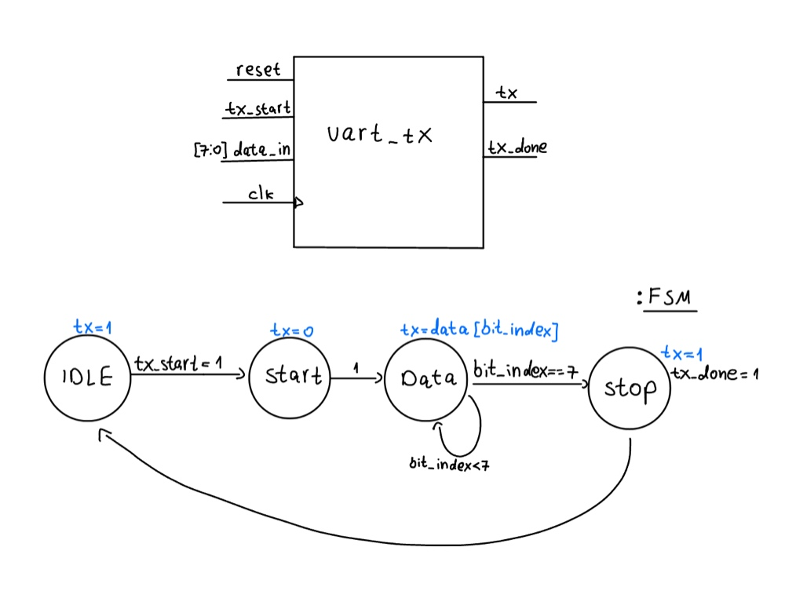
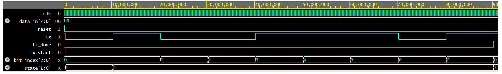

# UART Transmitter (RTL Design)

This project implements a fully functional, synthesizable UART Transmitter in Verilog. 
It is designed with a robust Finite State Machine (FSM) and a custom Baud Rate Generator.

## Architecture
The design is split into two main logical blocks:
1. **Baud Rate Generator:** Creates a single-cycle enable pulse (Tick) instead of a derived clock. This is a best practice in hardware design to keep the entire system synchronized to the main clock and prevent clock-domain crossing (CDC) issues.
2. **FSM (Finite State Machine):** Handles the transmission protocol directly, transitioning between IDLE, START, DATA, and STOP states based on the baud tick.

### FSM Diagram

## Simulation & Verification
The module was verified using a Verilog testbench. The simulation confirms correct bit-timing, state transitions, and expected behavior on the `tx` line.

### Waveforms
